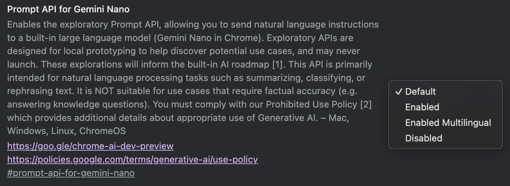
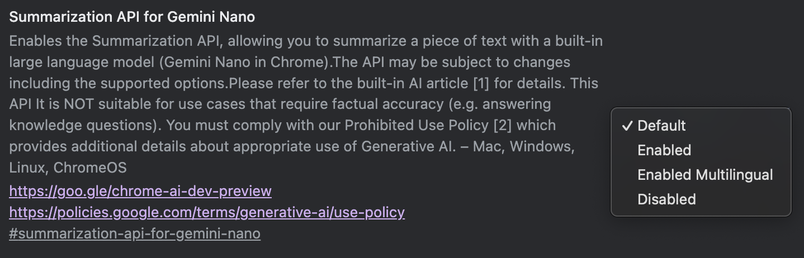
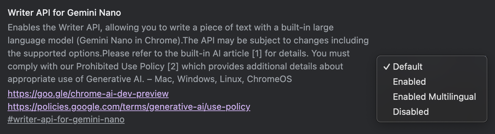

# RoleAlign — AI-powered CV ↔ Job Match Extension

**⚠️ IMPORTANT NOTICES:**

**CV Generation:** The AI-generated CV output is designed as a content draft, not a formatted document. You should copy the generated text and paste it into your own professionally formatted CV template. The extension focuses on intelligent content matching and tailoring, not document design.

**Supported Sites:** Currently works on **LinkedIn only**. Indeed support is in development.

One-time CV upload → continuous, private, on-page match scoring → AI-powered CV content generation.

---

## 📥 Installation (For End Users)

### Prerequisites
- **Chrome browser** (version 127 or newer recommended)
- **Chrome AI APIs enabled** (instructions below)

### Step 1: Download the Extension

1. Go to the [Releases page](../../releases)
2. Download the latest `chrome-mv3.zip` file
3. Extract the ZIP file to a folder on your computer

### Step 2: Enable Chrome AI APIs

**This extension requires Chrome's built-in AI features. Follow these steps carefully:**

1. Open Chrome and navigate to these flags (copy-paste into address bar):
   - `chrome://flags/#prompt-api-for-gemini-nano`
   - `chrome://flags/#summarization-api-for-gemini-nano`

2. Set each flag to **"Enabled"**

3. **Required screenshots for reference:**

   

   

   

4. **Restart Chrome completely** (close all Chrome windows)

5. **Verify AI is working** (open DevTools Console - F12):
   ```javascript
   console.log('AI available:', !!globalThis.ai?.languageModel);
   await globalThis.ai?.languageModel?.capabilities();
   ```

### Step 3: Install the Extension

1. Open Chrome and go to `chrome://extensions/`
2. Enable **"Developer mode"** (toggle in top-right corner)
3. Click **"Load unpacked"**
4. Select the extracted `chrome-mv3` folder
5. The RoleAlign icon should appear in your extensions toolbar

---

## 🎯 How to Use

### 1. Upload Your CV (One Time)
- Click the RoleAlign extension icon
- Paste your CV text or upload a PDF
- The extension will analyze and store it locally (never leaves your device)

### 2. Browse Jobs
- Visit **LinkedIn** job postings (Indeed support coming soon)
- RoleAlign automatically analyzes each job and shows a match score badge
- Click the badge to see detailed skill matches

### 3. Generate Tailored CV Content
- **Important:** The "Generate Tailored CV" button only appears when your match score is **80% or higher**
- If you want to change this threshold, see [entrypoints/linkedin.content.ts:358](entrypoints/linkedin.content.ts#L358)
- Click the button to generate job-specific CV content
- **Copy the generated text** and paste it into your own formatted CV template
- The output is optimized for content, not formatting

---

## 🔒 Privacy & Security

- **100% on-device processing** - Your CV never leaves your computer
- Uses Chrome's built-in AI (runs locally, no cloud servers)
- Data stored only in `chrome.storage.local`
- No external API calls or tracking

---

## 🚨 Troubleshooting

**Extension not working?**
1. Verify Chrome AI flags are enabled (see Step 2 above)
2. Restart Chrome completely
3. Check DevTools console for error messages

**No "Generate CV" button?**
- Your match score must be 80% or higher
- To change this threshold, edit [entrypoints/linkedin.content.ts:358](entrypoints/linkedin.content.ts#L358)

**CV generation not formatted properly?**
- This is expected behavior - copy the text content and use your own CV template

---

# 👨‍💻 For Developers

## Development Setup

### Prerequisites
- Node.js 18+
- pnpm (recommended) or npm
- **Chrome browser with AI flags enabled** (REQUIRED - no alternatives)

### Installation & Development

```bash
# 1. Install dependencies
pnpm install

# 2. For development with AI APIs enabled
pnpm dev:ai
# This automatically launches Chrome with AI flags enabled

# 3. Build production version
pnpm build
```

### Production Build

```bash
# Build for Chrome Web Store
pnpm build
pnpm zip
```

### Development Commands

| Command | Description |
|---------|-------------|
| `pnpm dev:ai` | **Recommended:** Build extension and launch Chrome with AI APIs enabled |
| `pnpm build` | Create production build |
| `pnpm compile` | Type check without emitting |
| `pnpm zip` | Package for Chrome Web Store |

⚠️ **Important:** Never use `pnpm dev` alone during development. Always use `pnpm dev:ai` or `pnpm build` for testing.

### File Structure

```
RoleAlign/
├─ entrypoints/
│  ├─ background/
│  │  └─ index.ts
│  ├─ content/
│  │  ├─ linkedin.content.ts
│  │  └─ indeed.content.ts
│  └─ popup/
│     ├─ index.html
│     ├─ main.tsx
│     └─ App.tsx
├─ src/
│  ├─ ai/
│  │  └─ chrome-ai.ts           # All on-device AI wrappers (Prompt/Summarizer/…)
│  ├─ match/
│  │  └─ score.ts               # Match score utils
│  ├─ messaging/
│  │  ├─ bus.ts                 # thin wrapper around chrome.runtime messaging
│  │  └─ types.ts               # typed messages
│  ├─ sites/
│  │  ├─ types.ts               # Site adapter interface
│  │  ├─ linkedin.ts            # LinkedIn adapter (DOM → text)
│  │  └─ indeed.ts              # Indeed adapter
│  ├─ storage/
│  │  └─ kv.ts                  # versioned keys + helpers
│  └─ util/
│     ├─ dom.ts                 # safe DOM helpers (inject badge/toast, qs)
│     └─ logger.ts              # small logger with prefixes
├─ types/
│  └─ chrome-ai.d.ts            # ambient types for AI APIs (minimal)
├─ public/
│  └─ icon/...                  # your icons
├─ wxt.config.ts
├─ tsconfig.json
└─ .gitignore
```

## 🧪 Testing the Extension

1. **Load extension in Chrome:**
   - Extension auto-loads during `pnpm dev:ai`
   - Or manually: Chrome → Extensions → Load unpacked → `.output/chrome-mv3`

2. **Test CV upload:**
   - Click extension icon → Upload CV text/file
   - Watch browser console for logs

3. **Test job matching:**
   - Visit LinkedIn or Indeed job page
   - Look for match badge (if auto-badge enabled)
   - Check console logs for job analysis

## 📋 Development Notes

- **TypeScript**: Full type safety with strict mode
- **Hot Reload**: Changes auto-reload the extension
- **Logging**: Comprehensive logging for debugging
- **Chrome MV3**: Uses latest Manifest V3 architecture

### Site Support Status

- ✅ **LinkedIn**: Fully supported
- 🚧 **Indeed**: In development (adapter exists in [src/sites/indeed.ts](src/sites/indeed.ts), needs content script implementation)

To add Indeed support, create `entrypoints/indeed.content.ts` following the pattern in [entrypoints/linkedin.content.ts](entrypoints/linkedin.content.ts).

### AI Prompts Location

All AI prompts can be customized to improve accuracy:

- **CV Parsing**: [src/ai/chrome-ai.ts:325](src/ai/chrome-ai.ts#L325) - Extract structured data from CV
- **Job Matching**: [src/match/score.ts:191](src/match/score.ts#L191) - Evaluate CV-job compatibility
- **CV Tailoring**: [src/cv/tailoring-engine.ts:192](src/cv/tailoring-engine.ts#L192) - Generate tailored CV content
- **Summary Generation**: [src/cv/tailoring-engine.ts:192](src/cv/tailoring-engine.ts#L192) - Create professional summaries
- **Skills Optimization**: [src/cv/tailoring-engine.ts:376](src/cv/tailoring-engine.ts#L376) - Reorder/enhance skills list

Feel free to experiment with prompt engineering to improve output quality!

---

# RoleAlign — Technical Architecture

**One-time CV upload → continuous, private, on-page match scoring → one-click tailored CV generation.**
RoleAlign analyzes a user's CV once, saves the structured result locally, and then automatically scores any supported job page the user visits (LinkedIn/Indeed). A badge shows the match %, and a button lets the user generate and download a tailored CV—**all on-device**.

---

## ✨ Core Features

* **Upload once, use everywhere**

  * User submits CV once (text/PDF → text).
  * Extension uses **Chrome AI** to parse & **save analyzed CV** (structured JSON) locally.
  * Future visits to job pages instantly re-use the saved analysis—no re-upload.
* **AI-powered job analysis**

  * When the user lands on a supported job page, RoleAlign uses **Chrome AI** to parse the posting and **pops a badge** (top-right) with a **match %**.
  * Click the badge to open details (matched/missing skills, AI-generated rationale).
* **One-click tailored CV generation**

  * From the details panel, the user can **Generate Tailored CV**.
  * **Requires Chrome AI** - no fallback methods available.
  * Output is generated locally using AI and offered as a **download** (Markdown format).
* **Strict AI-only architecture**

  * **100% dependent on Chrome built-in AI** (Prompt/Summarizer APIs).
  * **NO fallback mechanisms** - if AI is unavailable, features will not work.
  * All skill extraction, job analysis, and CV generation powered by AI.
* **Zero server dependency**

  * Storage via `chrome.storage.local` (namespaced & versioned).
  * No external APIs required - completely on-device processing.

---

## 🧭 User Flow (What the user experiences)

1. **Install extension** → open popup → **Upload CV** (paste text or drop PDF).
2. Extension uses **Chrome AI** to extract structured data (name, skills, experience, etc.) and **stores it locally**.
3. User browses LinkedIn/Indeed job pages:

   * A **match badge** appears with **Match: 0–100%** (powered by AI analysis).
   * Clicking it opens a panel showing **AI-analyzed matched/missing skills** and reasoning.
4. User clicks **Generate Tailored CV** → extension uses **Chrome AI** to produce a job-specific CV on-device → **Download**.

> ⚠️ **All steps require Chrome AI to be available.** The CV is parsed **once** using AI and cached. If the user updates their CV, the extension detects a content hash change, re-parses with AI, and updates the cache automatically.

---

## 🧱 How it's implemented (at a glance)

* **CV Lifecycle**

  * `popup/App.tsx` → user input → `AI.Prompt.extractCv()` **(Chrome AI required)**
  * Persisted to `kv.set('cv.current', { data, meta: { version, hash, updatedAt } })`
  * Background keeps **only the AI-structured result**; raw text can be discarded (configurable).
* **Job Page Lifecycle**

  * Content script (site adapter) extracts normalized job text + metadata.
  * Sends `ANALYZE_JOB` → background uses **Chrome AI** to analyze requirements → returns structured job data.
  * Background computes score: **AI-powered semantic matching** with enhanced skill extraction.
  * Content script **mounts a badge** with the AI-computed score; clicking opens AI-generated details.
* **Tailored CV Generation**

  * Content → `GENERATE_TAILORED_CV` → background uses **Chrome AI Prompt API** to rewrite user CV for the job → returns text → content offers **download**.

> **Critical:** All AI operations have strict timeouts and **no fallback mechanisms**. If Chrome AI is unavailable, these features will fail gracefully with clear error messages.

---

## 🗂️ Stored Keys (chrome.storage.local)

* `cv.current`

  ```ts
  {
    data: { basics, skills, experience, education, projects, ... },
    meta: { version: 1, hash: "sha256:...", updatedAt: 1737400000000 }
  }
  ```
* `settings`

  ```ts
  {
    ui: { autoBadge: true, showToasts: true },
    scoring: { method: "blend", blendAlpha: 0.6 },
    privacy: { keepRawCv: false }
  }
  ```
* `telemetry` (optional, local only)

  ```ts
  { lastScore: { url, score, ts }, ... }
  ```

---

## 🔄 State Machine (simplified)

```
[NoCV]
  └──(User uploads CV)──> [CVParsed]
[CVParsed]
  ├──(Navigate job page)──> [JobDetected]
  │     ├─ Parse job
  │     ├─ Summarize requirements
  │     ├─ Score (deterministic ± AI)
  │     └─ Show badge/panel
  └──(User updates CV)──> [CVParsed*] re-parse if hash changed
[JobDetected]
  ├──(Generate Tailored CV)──> [TailoredReady] → download
  └──(Navigate away)──> [CVParsed] (unmount)
```

---

## ⚙️ Settings that affect the flow

* **Auto badge:** if off, content script doesn't show the badge automatically; user can open the popup and click "Score this page."
* **Keep raw CV:** for privacy, default is **false** (discard raw text, keep only AI-structured result).
* **Scoring method:** Currently **AI-only** - no deterministic fallbacks available.
* **AI Dependencies:** All features require Chrome AI APIs to be enabled and available.

---

## 🔐 Privacy Notes

* The AI-analyzed CV JSON and tailored CV are stored **locally**.
* **Chrome built-in AI models** run on-device.
* If on-device AI models aren't available, features **fail completely** (no cloud fallbacks).
* Host permissions limited to supported job sites; content scripts are **shadow-DOM isolated**.
* All skill extraction and job analysis happens locally using Chrome AI APIs.

---

## 🧪 QA Checklist (for this flow)

* [ ] **AI Availability Check:** Verify Chrome AI APIs are enabled before testing any functionality.
* [ ] Upload CV once → refresh browser → AI-analyzed CV remains available (storage OK).
* [ ] Navigate several LinkedIn/Indeed job pages → AI-powered badge shows without re-upload.
* [ ] Toggle **Auto badge** off → badge no longer appears automatically; AI scoring via popup still works.
* [ ] Generate tailored CV for at least two different jobs → AI outputs differ appropriately.
* [ ] **AI Failure Test:** Disable built-in AI → all features should fail gracefully with clear error messages.
* [ ] Update CV contents → hash changes → CV gets re-analyzed with AI and results refresh.
* [ ] **Skill Extraction Quality:** Verify AI extracts only legitimate technical skills, not random words.

## 🚨 Critical Development Restrictions

**These restrictions must be followed in all future development:**

1. **NO fallback mechanisms** - If Chrome AI is unavailable, features must fail gracefully
2. **NO hardcoded skill arrays** - All skill extraction must be AI-driven and dynamic
3. **NO regex-based skill matching** - Only AI-powered skill analysis is permitted
4. **DO NOT use `pnpm dev`** - Always use `pnpm dev:ai` or `pnpm build` for testing
5. **AI-first architecture** - Every text analysis operation must use Chrome AI APIs
6. **Fail-fast approach** - If AI isn't available, don't attempt alternative methods
